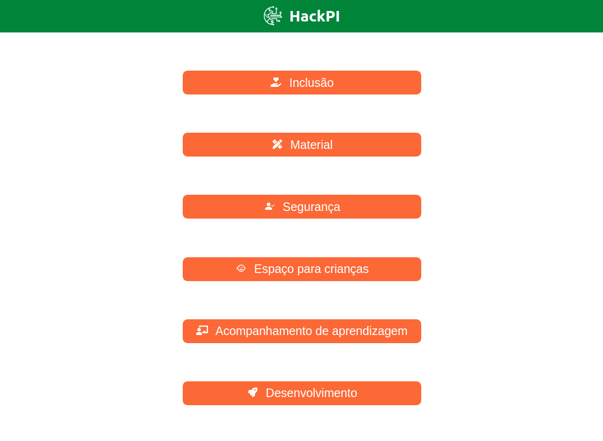
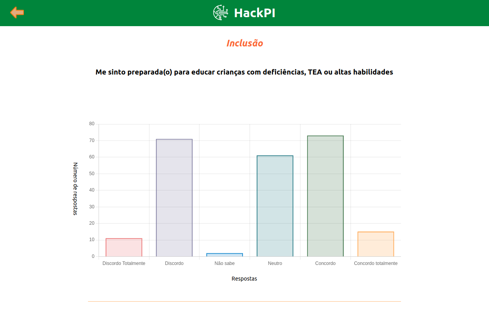

<h1 align="center">👶 HackPI</h1>

## ℹ️ Sobre

_O estado do Ceará, por meio do Programa Mais Infância Ceará, iniciou uma série de ações apoiando os municípios em políticas de melhoria da qualidade dedicadas à Primeira Infância, garantindo os direitos das crianças de forma intersetorial por meio da Educação, Saúde e Assistência Social, promovendo o desenvolvimento integral.Nesse contexto, o Governo do Estado do Ceará, em conjunto com diversas organizações do terceiro setor, vem somando esforços por meio de uma coalizão que, via regime de colaboração, tem como objetivo promover o desenvolvimento integral das crianças cearenses, em especial aquelas em situação de extrema vulnerabilidade._ [(Referência)](https://www.instagram.com/p/CTSxlOErhPi/)

---

## 💡 Plataforma

Nosso projeto tem como foco potencializar o uso e a interpretação de dados. Assim, seguindo esta premissa, por meio da base que foi disponibilizada no início do evento, buscamos obter resultados que possibilitem a geração de informações, as quais, por sua vez, podem ser úteis para tomadas de decisão nos diferentes eixos abrangidos pelo projeto da Primeira Infância.

---

## 🧰 Ferramentas

A plataforma foi construída com as seguintes tecnologias:

- **Front-end:**

  - ReactJS
  - React Chart.js

- **Back-end:**

  - Flask
  - Pandas
  - Heroku

---

## 🚀 Prévias

### Menu Principal

### Gráfico

